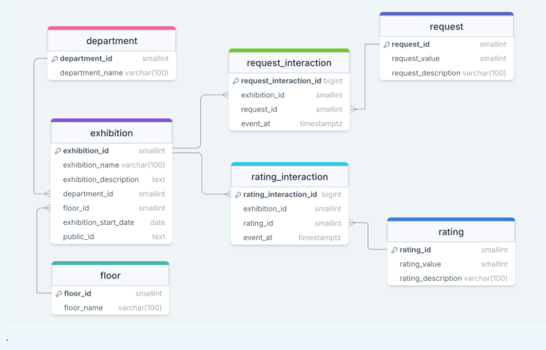

# Example Database

- Use the `schema.sql` to build the tables used in the example database for Liverpool Natural History Museum
- Relational chema for example:

## `schema.sql`

- The database schema for making the example database of Liverpool natural history museum
- Is ran by the `setup_rds` shell script found in the scripts directory
- Can be run in any postgres database